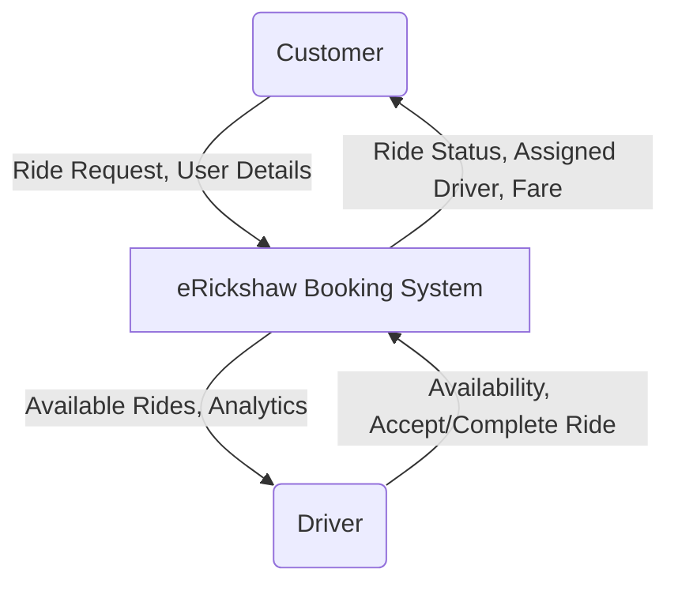
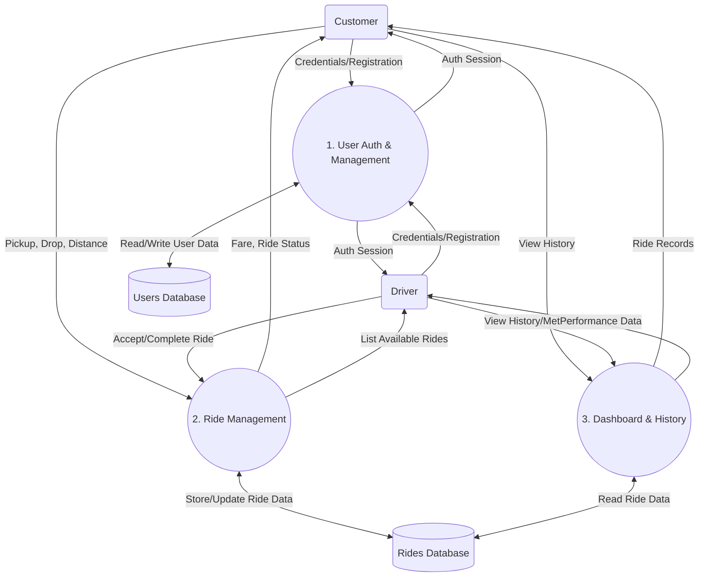

# eRickshaw: A Web-Based Ride Booking System

### Abstract
The eRickshaw project is a web-based application developed using the Django web framework to facilitate the booking and management of electric rickshaw rides. The system provides a platform connecting customers who need transportation with available drivers. It features role-based access control, ride requesting, fare calculation, and ride tracking.

---

### 1. Introduction

**1.1 Purpose**
The primary purpose of the eRickshaw system is to digitize the process of finding and booking e-rickshaws. It aims to provide convenience for passengers by allowing them to request rides from their devices and to increase business opportunities for drivers by giving them a centralized platform to find nearby passengers.

**1.2 Objectives**
*   To implement a secure user authentication system supporting multiple user roles (Customers and Drivers).
*   To enable customers to seamlessly request rides by specifying pickup locations, drop-off destinations, and distances.
*   To provide drivers with a portal to view available ride requests and accept them in real-time.
*   To offer dedicated dashboards for both user types to track ride history and current statuses.
*   To automate fare calculation based on travel distance.

---

### 2. Technology Stack

*   **Backend Framework:** Django (Python 3.x) - Chosen for its robust security features, built-in ORM, and rapid development capabilities.
*   **Database:** SQLite - The default relational database provided by Django, utilized for persistent data storage of users and ride information.
*   **Frontend:** HTML5, CSS3, and Django Templates - Used for rendering dynamic user interfaces based on backend data.
*   **Authentication:** Django's built-in authentication system (`django.contrib.auth`), extended with custom profiles to handle roles.

---

### 3. System Architecture and Design

The application follows the **MVT (Model-View-Template)** architectural pattern inherent to the Django framework:
*   **Model:** Defines the data structure and business logic. Models translate Python classes into database tables using the Django ORM.
*   **View:** Handles user requests, processes data using models, and dictates which template should be rendered.
*   **Template:** The presentation layer containing HTML and Django template tags to dynamically display data to the user.

---

### 4. Data Flow Diagrams (DFD)

#### 4.1 Level 0 (Context Diagram)
The Context Diagram shows the eRickshaw system as a single high-level process interacting with external entities (Customer and Driver).

#### 4.2 Level 1 DFD
The Level 1 DFD breaks down the main system into its core sub-processes: User Authentication, Ride Management, and Dashboard/Reporting, showing how data moves between these processes and data stores.

### 4. Database Schema (Models)

The project's data is logically structured into two primary Django applications: `accounts` and `booking`.

#### 4.1 User Management (`accounts` App)
*   **User Model:** Utilizes Django's built-in `User` model to handle core authentication data (username, password, superuser status).
*   **Profile Model:** Extends the `User` model via a One-to-One relationship to store application-specific user data.
    *   `user`: OneToOne relationship mapping to the core User.
    *   `user_type`: A character field distinguishing the user's role, constrained to choices: `'customer'` or `'driver'`.

#### 4.2 Ride Management (`booking` App)
*   **Ride Model:** Represents a single ride transaction and its lifecycle.
    *   `customer`: ForeignKey relationship to the `User` who requested the ride.
    *   `driver`: ForeignKey relationship to the `User` who accepted the ride (nullable, as it is unassigned upon creation).
    *   `pickup`: String denoting the starting location.
    *   `drop`: String denoting the destination.
    *   `distance`: Float value representing the journey distance.
    *   `fare`: Float value automatically calculated upon request creation.
    *   `status`: Tracks the ride lifecycle. Choices include: `'requested'`, `'accepted'`, and `'completed'`.
    *   `created_at`: DateTime field automatically logging when the request was made.

---

### 5. Functional Modules and Features

#### 5.1 Account & Role Management
*   **Registration (`register` view):** Users can sign up and explicitly select their role. The system securely saves the password and automatically provisions a corresponding `Profile` entry.
*   **Intelligent Routing (`login_view`):** The custom login mechanism evaluates the authenticated user's role (`is_superuser`, `driver`, or `customer`) and redirects them to their respective operational dashboard.
*   **Dashboards:**
    *   *Customer Dashboard:* Displays active and recent ride requests made by the customer.
    *   *Driver Dashboard:* Displays the driver's accepted rides and analytical metrics (e.g., total accepted count).

#### 5.2 Ride Lifecycle & Booking Flow
1.  **Requesting (`create_ride` view):** Customers submit a ride form with pickup, drop, and distance. The system computes the fare (`distance * farePerKm` where base rate is 10) and saves the ride with a status of `'requested'`.
2.  **Dispatching (`available_rides` view):** Drivers access a live board displaying all rides currently in the `'requested'` state.
3.  **Acceptance (`accept_ride` view):** A driver claims a ride. The system assigns the driver to the `Ride` record and updates the status to `'accepted'`.
4.  **Completion (`complete_ride` view):** Upon reaching the destination, the driver marks the ride as `'completed'`.
5.  **History (`ride_history` view):** Both users maintain a log of their past transactions for reference.

---

### 6. Implementation Details & Security

*   **Access Control:** The system heavily utilizes Django's `@login_required` decorator. This ensures that unauthorized guests cannot access endpoints meant for registered customers or drivers, preventing direct URL manipulation.
*   **Data Integrity:** The `driver` field in the `Ride` model uses `on_delete=models.SET_NULL`. This ensures that if a driver's account is deleted, the historical ride records of customers are preserved, simply showing the driver as null rather than cascading the deletion.
*   **Form Validation:** Django Forms (`RegisterForm`, `RideForm`) are used to validate user input before processing database transactions, protecting against malicious injections or malformed data.

---

### 7. Conclusion and Future Enhancements

**Conclusion**
The eRickshaw project successfully implements a foundational ride-hailing architecture. By cleanly separating user management (`accounts`) from business logic (`booking`), it achieves a modular, maintainable design. The role-based routing and status-driven ride lifecycle effectively solve the problem of connecting passengers with drivers.

**Future Scope**
To evolve into a production-ready system, the following features could be integrated:
*   **Geolocation & Maps:** Integrating Google Maps API for accurate location selection, distance calculation, and live tracking.
*   **Real-time Capabilities:** Implementing Django Channels (WebSockets) to instantly notify drivers of new requests without page refreshes.
*   **Payment Gateway:** Integrating Stripe or Razorpay for cashless transactions.
*   **Review & Rating System:** Allowing customers and drivers to rate each other post-ride for quality assurance.
*   **Cache List APIs and Frequently Accessed Records to Reduce Database Abuse:** 
